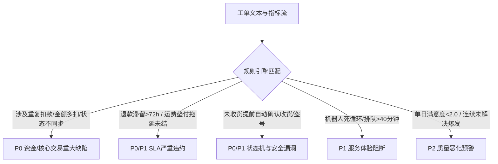

# 📐 系统架构与多维分析设计方案 (System Architecture & Methodology)

本项目基于 Python 3 与现代化原生 Web 技术栈构建，旨在为客服主管与技术运营团队提供全自动、端到端的工单数据清洗、多维趋势挖掘、统计学/规则驱动的异常诊断，以及交互式决策看板。

---

## 1. 整体系统架构 (Architecture Overview)

```
                       [ 原始数据源 ]
                     data/tickets.json
                            │
                            ▼
              ┌───────────────────────────┐
              │    TicketAnalyzer 核心引擎 │
              │      (src/analyzer.py)    │
              └─────────────┬─────────────┘
                            │
       ┌────────────────────┼────────────────────┐
       │                    │                    │
       ▼                    ▼                    ▼
[ 多维指标聚合 ]     [ 智能异常挖掘引擎 ]    [ 细分根因聚类 ]
- 业务分类透视       - P0/P1/P2 风险定级    - 支付重复扣款
- 时序质量演变       - 证据链与根因溯源     - 运费垫付报销
- 渠道服务效能       - 主管治理行动指引     - 机器人死循环
- SLA 违约监控                              - 状态机漏洞
       │                    │                    │
       └────────────────────┼────────────────────┘
                            │
                            ▼
              ┌───────────────────────────┐
              │    ReportGenerator 生成器  │
              │     (src/visualizer.py)   │
              └─────────────┬─────────────┘
                            │
            ┌───────────────┴───────────────┐
            ▼                               ▼
    [ 结构化决策报告 ]               [ 交互式可视化看板 ]
 docs/analysis_report.md           web/index.html & app.js
```

---

## 2. 核心分析维度设计与主管决策价值

| 分析维度 | 分析切入点与指标 | 对主管的决策价值 |
| :--- | :--- | :--- |
| **维度 1: 业务分类与风险矩阵** | 分类占比、SLA超时耗时、满意度分布、未解决率 | 明确客诉资源消耗重心，识别哪个业务域正在严重拖垮整体体验（如支付与退款占 58%）。 |
| **维度 2: 时序演变与质量拐点** | 日级工单量、每日解决状态、单日满意度均值走势 | 监控突发事件与服务质量拐点（如6.08起出现断崖式下跌，定位异常爆发周期）。 |
| **维度 3: 渠道效能与响应深度** | 在线 vs 电话渠道解决率、处理耗时、高优比重 | 评估各渠道服务承载力，发现电话渠道耗时（31.6h）是在线（14.1h）的 2.2 倍，优化排班与路由。 |
| **维度 4: 细分子问题与深层体验** | 基于语义关键词的穿透式聚类与事实证据链 | 突破宏观分类表象，直击系统级 Bug（重复扣款、自动确认收货）与流程断点（运费垫付滞后）。 |

---

## 3. 异常检测规则与定级机制



---

## 4. 自动化测试与工程质量保障
- 单元测试集：`tests/test_analyzer.py`
- 覆盖率：核心指标计算、异常检测规则命中、未解决工单识别、子问题聚类。
- 零第三方重度依赖，Python 标准库原生运行，兼具极致性能与跨平台可移植性。
